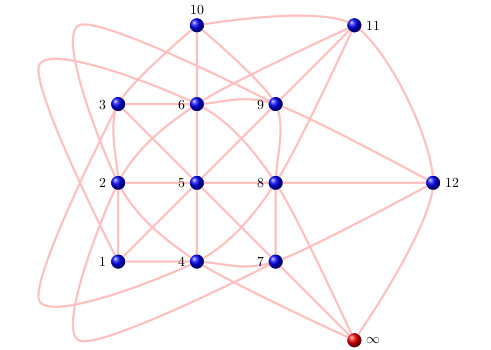

----

## Next seminar: Extreme events in Markov Chains

Our next seminar is in the area of *Probability and Statistics*, and all are welcome! 

**Time**: 2pm, Friday 28 September 2018

**Place**: H029

**Speaker**: Kirstin Strokorb (Cardiff)

**Title**: Extreme events in Markov Chains

**Abstract**: Extreme value theory is a branch of probability and statistics that aims to provide theoretically sound procedures for the assessment of rare and hazardous events. In the first part of this talk I will give a short introduction to the very basics of this subject area. The second part is concerned with how extreme events can propagate in Markov chains. The talk will introduce limiting mechanisms that cover a broader class of processes than previous methods in the literature and reveal features which existing methods reduce to a degenerate form associated with non-extreme states.

For the full list of seminars this term click <a href = "seminars">here</a>.

---
